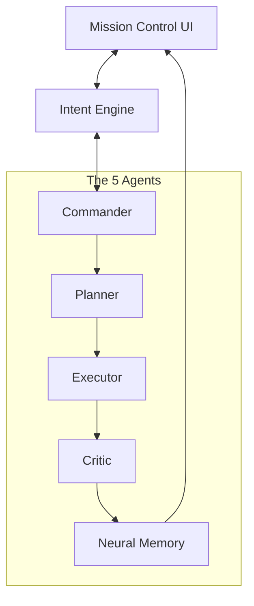

<p align="center">
  
</p>

<h1 align="center">AURA OS</h1>

<p align="center">
  <strong>The Proactive Neural Operating System</strong><br />
  <em>Moving beyond chatbots to autonomous digital agency.</em>
</p>

<p align="center">
  
  
  
</p>

---

## 🌌 The Vision

**Aura OS** is not just another wrapper for an LLM. It is a real-time, multi-agent autonomous system designed to operate your digital life. Built with a sophisticated **5-Agent Core**, Aura transitions from reactive chat interactions to proactive initiative, anticipating user needs and executing complex workflows across multiple tools.

## 🧠 Core Architecture

Aura operates through a neural loop that ensures every action is planned, executed, and validated.



### The 5 Specialized Agents

| Agent | Designation | Role |
| :--- | :--- | :--- |
| 🔆 | **Commander** | Interprets high-level intent and decides execution strategy. |
| 🗺️ | **Planner** | Decomposes complex tasks into atomic, executable steps. |
| ⚙️ | **Executor** | Interacts with the OS and APIs to perform real-world actions. |
| 🧠 | **Memory** | A 3-layer neural storage system for short, long, and semantic context. |
| 🔍 | **Critic** | Validates output quality and detects conflicts before finalization. |

---

## ✨ Key Features

- **Living Mesh Design**: A premium, glassmorphic "Mission Control" interface that feels alive.
- **Proactive Engine**: Aura doesn't just wait for commands; it analyzes patterns to suggest and take initiative.
- **Dynamic Voice Visualization**: Real-time feedback for voice-driven interactions.
- **Simulation Engine**: Safely test complex OS-level commands in a sandboxed environment.
- **Privacy-First**: Optimized for local-first execution with local LLM support via Ollama.

---

## 🛠️ Tech Stack

- **Frontend**: Next.js 14, TypeScript, Vanilla CSS (Premium Glassmorphism), Framer Motion.
- **Backend**: FastAPI, Python 3.11+, PostgreSQL (Structured), Redis (Transient), ChromaDB (Vector).
- **Intelligence**: LLM-agnostic (optimized for Llama 3, Phi-3), Ollama integration.

---

## 🚀 Quick Start

### Prerequisites
- Python 3.11+ & Node.js 18+
- Docker Desktop
- [Ollama](https://ollama.com/) (Recommended for local inference)

### 1. Initialize Infrastructure
```bash
# Clone the repository
git clone https://github.com/heatblaze/Aura_OS.git
cd Aura_OS

# Start core services (Redis, PG, Chroma)
docker-compose up -d
```

### 2. Backend Setup
```bash
cd backend
python -m venv venv
source venv/bin/activate  # .\venv\Scripts\Activate.ps1 on Windows
pip install -r requirements.txt
playwright install chromium
python main.py
```

### 3. Frontend Setup
```bash
cd ../frontend
npm install
npm run dev
```

---

## 🗺️ Roadmap

- [x] **Phase 1**: Multi-agent loop, Intent Engine, Basic Memory, Chat UI.
- [x] **Phase 2**: Real-time Dashboard (Mission Control), WebSocket streaming.
- [/] **Phase 3**: Proactive Initiative Engine, Voice Integration.
- [ ] **Phase 4**: Simulation Engine & Autonomous Reflection.
- [ ] **Phase 5**: Behavioral Persona Learning & Advanced Optimization.

---

<p align="center">
  Built with ❤️ by the Aura Development Team
</p>
